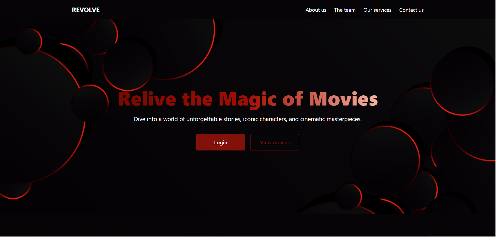

# Revolve

**Revolve** is a simple React web page that showcases a collection of movie posters. It features a clean hero banner, a movie gallery, and a footer — just the basics to help me get started with React!

---

## Features

- ✅ Hero section with title and buttons
- 🎥 Gallery displaying movie posters and titles
- 📦 Footer with simple branding
- 🔄 Dynamic rendering with props and reusable components

---

## Built With

- [React](https://reactjs.org/)
- JavaScript (ES6)
- HTML & CSS (with Flexbox)

---